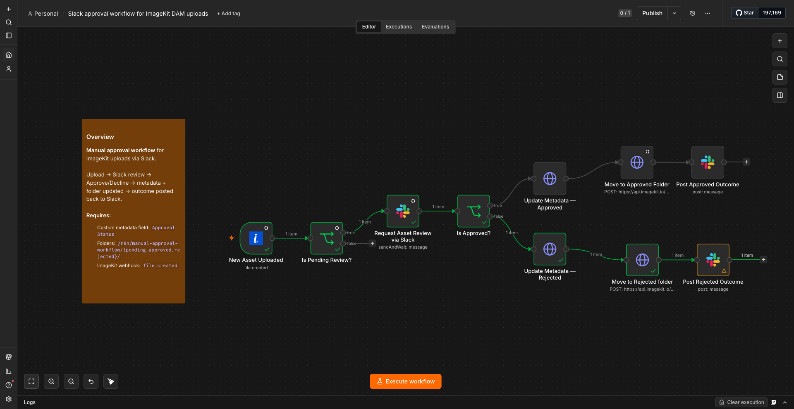

# ImageKit + n8n Workflows

A collection of n8n workflow automation examples built around ImageKit — media library events, DAM organization, and review/approval automation.

This is a personal/learning collection, separate from ImageKit's own official sample workflows. If any of these prove generally useful, the goal is to eventually contribute them back upstream.

## Official resources

- [n8n docs](https://docs.n8n.io/)
- [ImageKit n8n Integration docs](https://imagekit.io/docs/integration/n8n)
- [Official `@imagekit/n8n-nodes-imagekit` node source](https://github.com/imagekit-developer/n8n-nodes-imagekit)
- [Official sample workflows](https://github.com/imagekit-developer/n8n-nodes-imagekit/tree/main/sample-workflows)

## What's in `sample-workflows/`

Each file is a standard n8n workflow export (`.json`) — import via n8n's **Workflows → Import from URL / JSON**. Documentation for each workflow lives inside the canvas itself as sticky notes, same convention as the official samples above.

| Workflow | What it does |
|---|---|
| [`Slack approval workflow for ImageKit DAM uploads.json`](sample-workflows/Slack%20approval%20workflow%20for%20ImageKit%20DAM%20uploads.json) | Human-in-the-loop review: new uploads to a `pending/` folder trigger a Slack approval request (Approve/Decline). The response updates the file's `Approval Status` custom metadata, moves it to `approved/` or `rejected/`, and posts the outcome back to Slack. |

## Setup

Requires:
- An n8n instance (self-hosted or Cloud) with the `@imagekit/n8n-nodes-imagekit` community node installed
- An ImageKit account with API access
- For webhook-based workflows: a way to expose your n8n instance publicly (e.g. a tunnel like ngrok, if self-hosting locally)

For a self-hosted setup (OrbStack/Docker + ngrok, why and how), see [`docs/local-setup.md`](docs/local-setup.md).
